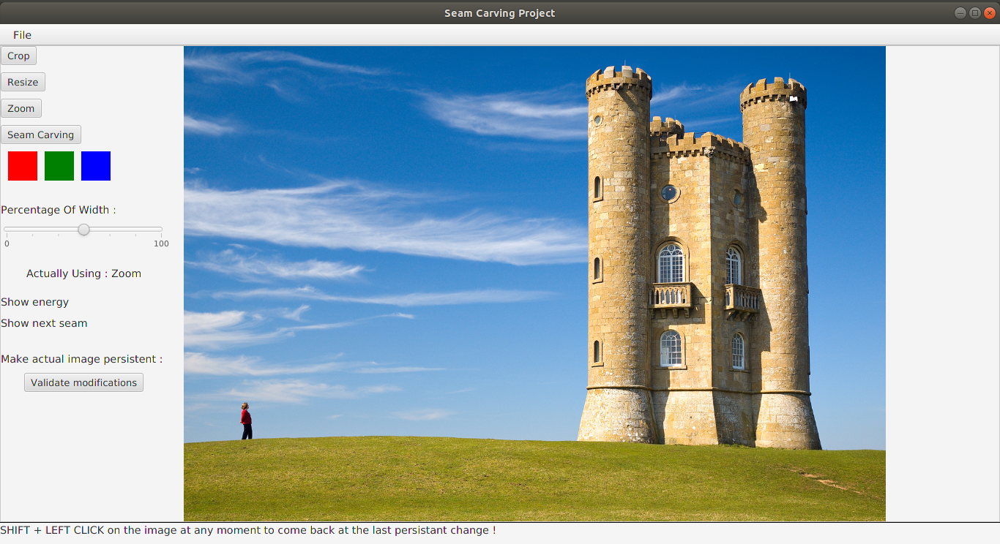

# ResizingApp

## Table of Contents
1. [Introduction](#introduction)
1. [Difficultés rencontrées](#difficultés-rencontrées)
1. [Extensions de base](#extensions-de-base)
    1. [Recadrage (crop)](#recadrage-crop)
    1. [Mise à l'échelle](#mise-à-l'échelle)
    1. [Seam Carving](#seam-carving)
1. [Extensions rajoutées](#extensions-rajoutées)
    1. [Persistance des changements](#persistance-des-changements)
    1. [Remise à zéro des changements](#remise-à-zéro-des-changements)
    1. [Afficher gradients et énergie](#afficher-gradients-et-énergie)
    1. [Choix largeur hauteur](#choix-largeur-hauteur)
1. [Exemple de résultats](#exemple-de-résultats)

## Introduction 
Java 11, JavaFx

Rendu : 30 novembre

[sujet](https://docs.google.com/document/d/1WnQn_8BGB1dcxQVLzfz0Gq7P1-xpGMfX4qt73U7mLEM/edit)

[FXML](http://fxexperience.com/wp-content/uploads/2011/08/Introducing-FXML.pdf)

L’objectif de ce projet est l’implémentation d’une application de redimensionnement d’image en Java.
Cette application permettra d'effectuer les opérations suivantes sur une images : recadrage, mise à l’échelle et seam carving.

## Difficultés rencontrées

* resizing (mise à l'échelle) 
    * à effectuer sur la BufferedImage plutôt que sur l'ImageView

* crop (recardage)
    * dépendant du FXML et de sa définition de l'ImageView

* gradient 
    * a soulevé le problème de la copie de la BufferedImage
    
## Extensions de base
### Recadrage (crop)
Cette opération découpe l'image pour ne garder que le pourcentage de l'image d'origine choisi avec le slider

Choix d'implémentation :
* Pour le recadrage suivant la largeur, on fait le choix de ne garder que la partie gauche de l'image

### Mise à l'échelle
Cette opération permet de redimmensionner l'image pour qu'elle tienne dans la taille choisie avec slider.

Choix d'implémentation :
* 
### Seam Carving
On suit cet [algorithme](https://en.wikipedia.org/wiki/Seam_carving)

## Extensions rajoutées
### Persistance des changements
Fonctionnalité : permet d'enregistrer les changements depuis le dernier enregistrement (checkpoint)

Mode d'emploi : cliquer sur le bouton *Validate modifications*

Mis en oeuvre car il n'enregistre que les changements, il ne crée pas pour autant un sauvegarde de l'image au même titre que save.

### Remise à zéro des changements
Fontionalité : permet d'annuler les changements effectués depuis le dernier enregistrement

Mode d'emploi : Faire `SHIFT + left clic` pour revenir au dernier enregistrement et annuler toutes les modifications qui ont eu lieu.

### Zoom
Fonctionnalité : Permet de zoomer sur l'image.

Mode d'emploi :
1. sélectionner l'option zoom en appuyant sur le bouton zoom (option par défaut au lancement)
2. cliquer sur l'image pour zoomer sur cette zone

Implémenté car il nous a permis de faire bien la différence entre zoom, crop et resizing 

### Afficher gradients et énergie
Fonctionnalité :
1. Pour les gradients : permet d'afficher le gradient de la couleur du carré de couleur survolé
2. Pour l'énergie : permet d'afficher le résultat du calcul d'énergie sur l'image, ainsi que le seam d'énergie minimale

Mode d'emploi : Survoler la fonctionnalité désirée
* un des carrés de couleur pour le gradient de la couleur correspondante
* le Label d'énergie en fonction de si ce qui est souhaité est l'énergie ou l'énergie et le seam d'énergie minimale

Mis en oeuvre pour proposer une nouvelle façon de faire un choix à l'utilisateur, différent des boutons "classiques",
ils permettent de faire un changement temporaire, juste un affichage temporaire du résulats de l'opération souhaitée

### Choix largeur hauteur
Fonctionnalité : Choisir si l'utilisateur souhaite redimensionner (recadrage, mise à l'échelle, seam carving) en fonction
de la hauteur ou de la largeur.

Mode d'emploi :

## Exemple de résultats
L'interface utilisateur

Image d'origine

Après recadrage (crop)

Après mise à l'échelle (resizing)

Après seam carving

