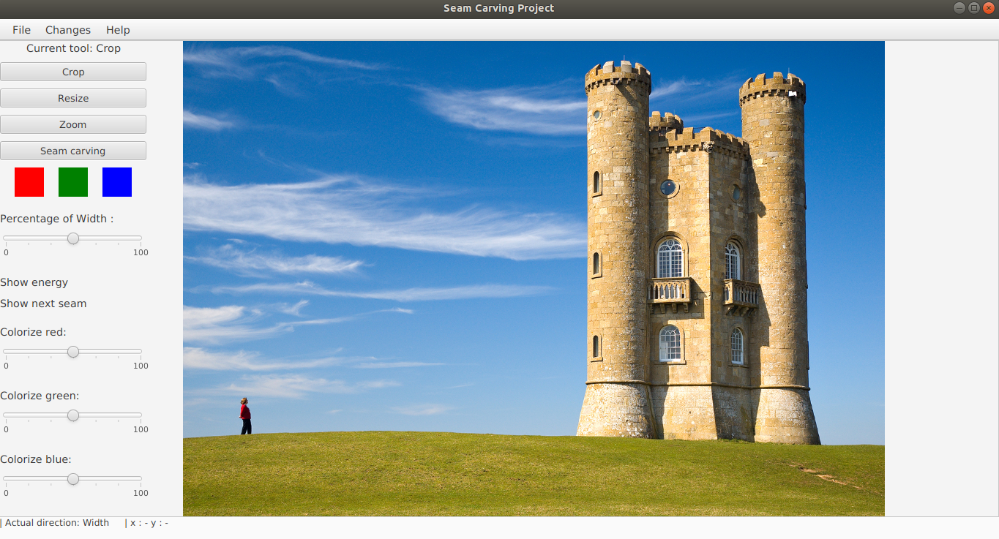

# ResizingApp

## Table of Contents
1. [Introduction](#introduction)
1. [Difficultés rencontrées](#difficultés-rencontrées)
1. [Extensions de base](#extensions-de-base)
    1. [Recadrage (crop)](#recadrage-crop)
    1. [Redimensionnement](#redimensionnement)
    1. [Seam Carving](#seam-carving)
    1. [Open & Save](#Open-&-Save-image-file)
1. [Extensions rajoutées](#extensions-rajoutées)
    1. [Persistance des changements](#persistance-des-changements)
    1. [Remise à zéro des changements](#remise-à-zéro-des-changements)
    1. [Zoom](#Zoom)   
    1. [Examples dynamiques](#Dynamic-display-:-Gradients-R/G/B-,-Energie-/-Seam)   
    1. [Choix de la dimension Height / Width](#Choix-du-sens-de-l'opération-:-Width-or-Height)   
    1. [Colorisation](#Fonctions-de-colorisation)
    1. [Raccourcis clavier](#Raccourcis-clavier)
    1. [Interface dynamique](#Interface-dynamique:-Position-du-pointeur,-opération-en-cours,-sens-de-modification.)
1. [Exemple de résultats](#exemple-de-résultats)

## Introduction 
Java 11, JavaFx

Rendu : 30 novembre

[sujet](https://docs.google.com/document/d/1WnQn_8BGB1dcxQVLzfz0Gq7P1-xpGMfX4qt73U7mLEM/edit)

[FXML](http://fxexperience.com/wp-content/uploads/2011/08/Introducing-FXML.pdf)

L’objectif de ce projet est l’implémentation d’une application de redimensionnement d’image en Java.
Cette application permettra d'effectuer les opérations suivantes sur une images : recadrage, mise à l’échelle et seam carving.

## Difficultés rencontrées

* resizing *(mise à l'échelle)*
    * à effectuer sur la BufferedImage plutôt que sur l'ImageView

* crop *(recardage)*
    * dépendant du FXML et de sa définition de l'ImageView

* gradient 
    * a soulevé le problème de la copie de la BufferedImage
    
* Multi Direction *(extension)*
    * a suscité de nombreux problèmes à cause des liens nécessaires avec l'ImageView définie dans le FXML.
## Extensions de base
### Recadrage (crop)
Cette opération découpe l'image pour ne garder que le pourcentage de l'image d'origine choisi avec le slider

Choix d'implémentation :
* Pour le recadrage suivant la largeur, on fait le choix de ne garder que la partie gauche de l'image.
* Pour le recadrage suivant la hauteur(extension), on fait le choix de ne garder que la partie haute de l'image.

### Redimensionnement
Cette opération permet de mettre à l'échelle l'image pour qu'elle tienne dans la taille choisie avec slider.

###Seam Carving
Nous suivons cet [algorithme](https://en.wikipedia.org/wiki/Seam_carving).

Choix d'implémentation :
* Pour le Seam Carving suivant la largeur, les seams verticales sont détruites une par une pour éviter des erreurs de suppression.
* Pour le Seam Carving suivant la hauteur(extension), les seams horizontales sont détruites une par une pour éviter des erreurs de suppression

###Open & Save image file
Cette opération permet d'ouvrir une image et de sauvegarder les changements effectués dessus.

Choix d'implémentation : 
* Ajout d'un chemin par défaut contenant plusieurs images d'example.
* Limitation aux fichiers image de type JPEG.

##Extensions rajoutées
###Persistance des changements
__Fonctionnalité :__ permet d'enregistrer les changements depuis le dernier enregistrement (checkpoint).

__Mode d'emploi :__ Faire `CTRL + C` ou cliquer Edit > *Validate modifs*.

Mis en oeuvre car il n'enregistre que les changements, il ne crée pas pour autant un sauvegarde de l'image au même titre que save.

###Remise à zéro des changements
__Fontionnalité :__ permet d'annuler les changements effectués depuis le dernier enregistrement

__Mode d'emploi :__ Faire `SHIFT + left clic` pour revenir au dernier enregistrement (checkpoint) ou cliquer sur Edit > Reset Modifs.

Mis en oeuvre pour permettre à l'utilisateur de revenir en arrière pour éviter d'enchainer les changements innoportuns.

###Zoom
__Fonctionnalité :__ Permet de zoomer sur l'image de manière intuitive par un clique de souris.

__Mode d'emploi :__
1. Sélectionner l'option zoom en appuyant sur le bouton zoom (option par défaut au lancement)
2. Cliquer sur l'image pour zoomer sur cette zone.

Implémenté pour permettre à l'utilisateur d'obtenir directement une sous image de manière très précise dans l'image. La valeur du slider est utilisée pour définir la puissance du zoom.

### Dynamic display : Gradients R/G/B , Energie / Seam
__Fonctionnalité :__
1. __Gradients :__ permet d'afficher le gradient de la couleur de votre choix.
2. __Energie et Seam :__ permet d'afficher le résultat du calcul d'énergie sur l'image, ainsi que le seam d'énergie minimale.

__Mode d'emploi :__ Survoler la surface associée.
* __Gradients :__ un des carrés de couleur pour le gradient de la couleur correspondante.
* __Energie et Seam :__ le Label d'énergie ou le label de l'énergie et du seam d'énergie minimale.

Mis en oeuvre pour proposer une nouvelle façon de faire un choix à l'utilisateur, différent des boutons "classiques",
ils permettent de faire un changement temporaire, juste un affichage temporaire du résulats de l'opération souhaitée. Le résultat est à titre informatif pour permettre à l'utilisateur de faire ses futurs choix d'opération.

### Choix du sens de l'opération : Width or Height
__Fonctionnalité :__ Choisir si l'utilisateur souhaite effectuer les opérations en fonction
de la hauteur ou de la largeur.

__Mode d'emploi :__ Faire `CTRL + D` ou cliquer sur Edit > Switch direction.

Implémenté pour fournir à l'utilisateur un degrès de liberté supérieur dans la modification de l'image en cours de modification.

### Fonctions de colorisation 
__Fonctionnalité :__ Permet de renforcer ou réduire l'intensité d'une des trois couleurs R/G/B. 

__Mode d'emploi :__ Utilisation du slider associé à la couleur à modifier. La modification se fait dynamiquement.

Cette utilisation des Listeners permet à l'utilisateur de modifier intrinsequement son image avant de faire des retouches de redimensionnement. 

### Raccourcis clavier
__Fonctionnalité:__ Permet d'activer rapidement les fonctionnalités implémentées.

__Mode d'emploi :__  Liste exclusive des raccourcis existant:

  - `CTRL + N` Ouverture d'un nouveau fichier image.
  - `CTRL + SHIFT + S` Sauvegarde des modifications en fichier image.
  - `CTRL + D` Choix du sens des opérations sur image.
  - `CTRL + C` Persistance des modifications réalisées.
  - `SHIFT + Left click` Retour au dernier checkpoint enregistré. 
 
Permet d'améliorer l'interface en relayant certaines fonctions dans le menu, sans pour autant sacrifier l'expérience utilisateur.

### Interface dynamique: Position du pointeur, opération en cours, sens de modification. 
 __Fonctionnalité :__ Permet une visualisation directe des caractéristiques de l'outil. Améliore l'expérience utilisateur.

__Mode d'emploi:__ 

- __Position du pointeur :__ Déplacer le curseur sur l'image affichée. l'affichage se fait en bas à gauche.  
- __Autres :__ aucun.

### Fonction d'aide
Permet d'accéder directement au fichier README.md pour comprendre les fonctionnalités.

## Exemple de résultats

__L'interface utilisateur__

__Image d'origine__

__Après recadrage (Crop)__

__Après mise à l'échelle (resizing)__

__Après seam carving__

